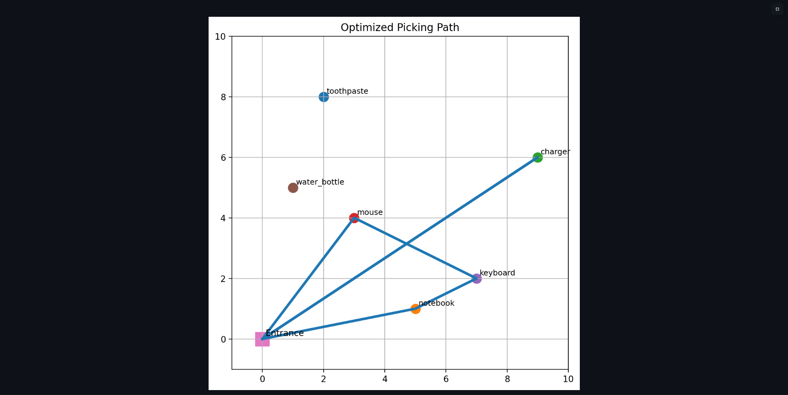
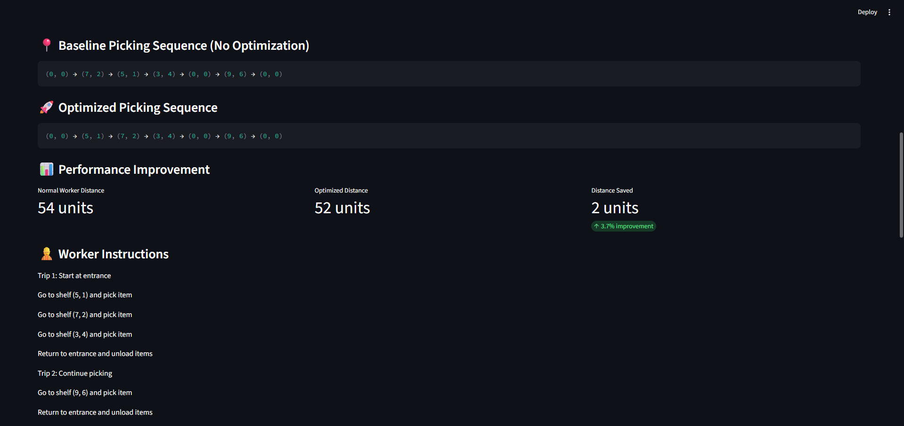
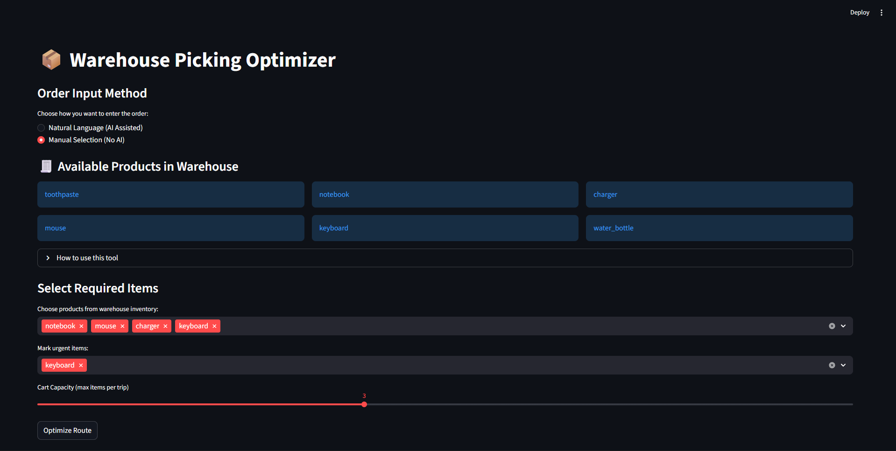

# Warehouse Picking Optimizer

Capacity-Constrained Route Optimization for Warehouse Order Fulfillment

Overview

In warehouse fulfillment operations, a major portion of order processing time is spent walking between shelves during item picking.
Workers often collect items in the order they remember them rather than in an efficient path, causing unnecessary travel across aisles.

This project implements a Warehouse Picking Optimizer — a decision-support system that computes an efficient picking route and generates clear instructions for the worker.

The application demonstrates how algorithmic optimization can improve operational efficiency without additional manpower.

The optimization engine is deterministic and works independently of AI.
Natural language processing is provided only as an optional input interface layer.

Problem Statement

Given:

A warehouse layout

Known shelf locations of products

A list of required items

Determine:

The optimal sequence in which items should be picked

The total walking distance required

Clear instructions for a warehouse worker

Manual picking typically causes:

Backtracking between aisles

Worker fatigue

Increased fulfillment time

The goal is to reduce walking distance through route planning.

Key Features
1) Dual Input Modes

The system supports two methods of order entry:

AI-Assisted Mode

User enters natural language

Example:
urgent charger and notebook, also get mouse

Manual Mode (No AI)

User selects items directly from inventory

Ensures deterministic reproducibility

Demonstrates the optimizer works independently of LLMs

2) Warehouse Modeling

The warehouse is modeled as a 2D grid.
Each product occupies a coordinate (shelf location), and the entrance acts as the starting/ending node.

3) Route Optimization Engine

The application implements a Nearest Neighbor heuristic to solve a variant of the Travelling Salesman Problem under constraints.

For each trip:

Start at entrance

Visit nearest unpicked shelf

Repeat until cart capacity reached

Return to entrance

Continue remaining items

4) Capacity-Constrained Picking

Workers have limited cart space.

The system splits orders into multiple trips:

Trip 1: Entrance → shelves → Entrance
Trip 2: Entrance → shelves → Entrance

This models real warehouse operations.

5) Distance Calculation

Walking distance uses Manhattan Distance:

distance = |x1 − x2| + |y1 − y2|

This reflects real aisle movement (no diagonal walking).

6) Baseline vs Optimized Comparison

The system computes two strategies:

Baseline: worker follows given order

Optimized: algorithm reorders shelves

The application displays:

walking distance

distance saved

improvement percentage

picking sequence

7) Visualization

The picking route is plotted on a warehouse map using Matplotlib, allowing visual verification of the optimization.

System Architecture

The system is divided into independent components:

Input Layer

Natural language input

Manual selection interface

Parsing & Validation

Extracts items

Validates against inventory

Optimization Engine

Grid warehouse model

Manhattan distance metric

Nearest neighbor routing

Multi-trip capacity handling

Output Layer

Worker instructions

Route visualization

Performance metrics

How to Run Locally
1. Clone repository
git clone https://github.com/GodNix28/Warehouse-picking-optimizer

2. Enter directory
cd Warehouse-picking-optimizer

3. Install dependencies
pip install -r requirements.txt

4. Run application
streamlit run app.py

Then open:

http://localhost:8501

Technologies Used
Component	Technology
Language	Python
UI	Streamlit
Visualization	Matplotlib
Optimization	Nearest Neighbor Heuristic
Distance Metric	Manhattan Distance
Optional NLP	Natural Language Parsing
Example Workflow

User enters or selects items

System validates products

Shelves are located

Optimizer computes route

Capacity trips generated

Distance calculated

Instructions displayed

Route visualized

Example Output

The application produces:

optimized picking order

baseline vs optimized comparison

total walking distance

step-by-step instructions

warehouse route map

Why This Matters

In real warehouses, walking accounts for a large portion of fulfillment time.
Even small reductions in distance per order scale significantly across hundreds of daily orders.

This system demonstrates how software planning alone can improve productivity without robotics or hardware changes.

Future Improvements

Multiple worker coordination

Real warehouse layout import

Dynamic order arrivals

Obstacle / blocked aisle simulation

Mobile interface for pickers

Conclusion

The Warehouse Picking Optimizer converts an order request into an actionable picking plan.
It models a real logistics problem and applies algorithmic optimization to reduce unnecessary movement.

The project demonstrates practical application of:

graph modeling

heuristic optimization

constraint handling

human-readable system output

Rather than being an AI chatbot, it is an operations optimization system with an optional AI interface.

## Screenshots

### Route Visualization

### Performance Comparison

### Manual Selection Mode

